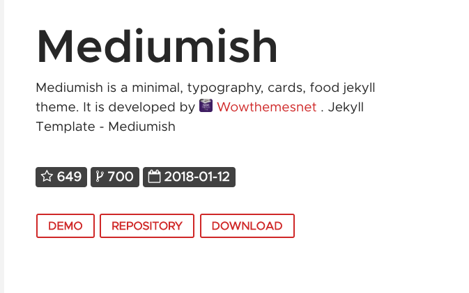
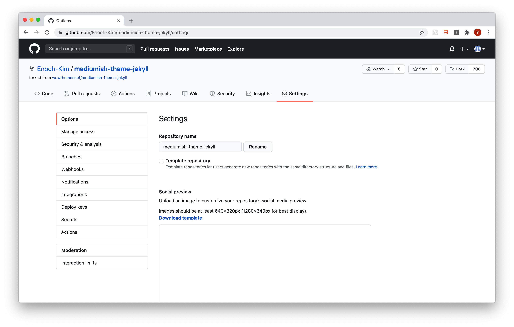
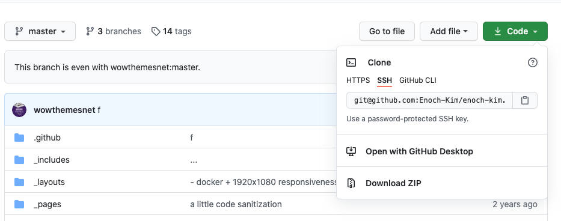
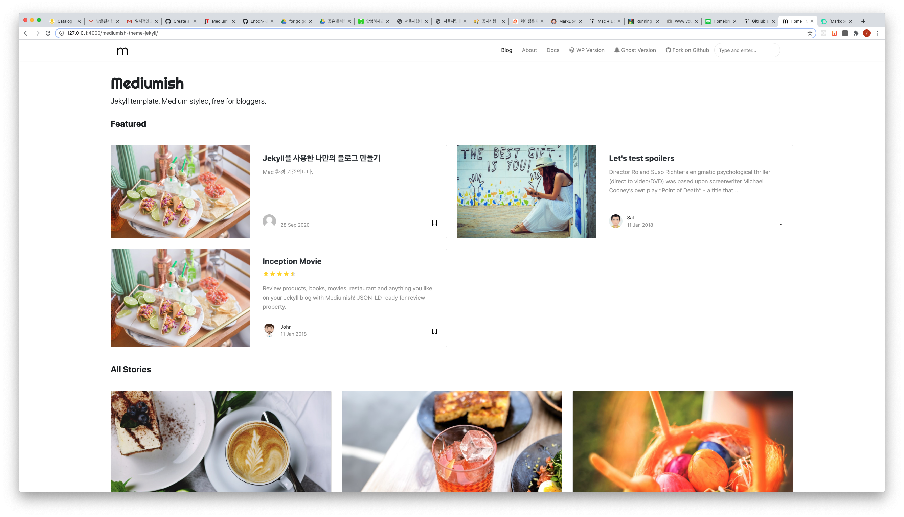

**이 포스트는 테스트용으로 이 저장소에서 작성했기 때문에, DSC UOS 블로그에도 동일한 포스트가 올라와 있습니다.**
Mac 환경 기준입니다.

(Mac의 경우 xcode가 설치돼있기 때문에 ruby도 함께 설치되어 있어 바로 사용할 수 있습니다.

만약 설치가 안되어 있다면 terminal창을 열고 다음의 command를 통해 xcode development tool과 ruby를 설치해 주세요.)
```
# install xcode development tool
xcode-select --install

# if home brew does not exist
/usr/bin/ruby -e "$(curl -fsSL https://raw.githubusercontent.com/Homebrew/install/master/install)"
# end if

# install ruby & setting env variable
brew install ruby
echo 'export PATH="/usr/local/opt/ruby/bin:$PATH"' >> ~/.bash_profile

# check ruby
which ruby
# /usr/local/opt/ruby/bin/ruby 가 나와야 합니다.
ruby -v
```    
우선 ruby를 통해 jekyll을 설치해줍니다. 
```
sudo gem install jekyll
```
내 '`깃헙 username`'.github.io 형식으로 jekyll 폴더를 생성합니다.

(깃헙 username이 대문자여도 소문자로 생성하는게 좋습니다. 저의 경우 Enoch-Kim 이지만 enoch-kim.github.io로 만들었습니다.)
```
jekyll new enoch-kim.github.io

# 폴더를 확인 후 해당 폴더로 이동
ls -al
cd enoch-kim.github.io
```
이제 자신의 github에 repository를 생성해줍니다. 이때, 위에서 생성한 폴더 이름과 동일한 repository를 만들어줘야합니다.

**여기서 잠깐!!! 이렇게 블로그를 만들면 처음부터 끝까지 커스텀해야하기 때문에 매우 ~~빡칩니다~~ 번거롭습니다.**
**만든 폴더를 삭제하고 좀 있다 소개할 블로그 템플릿을 이용하는 것을 권장합니다.**
```
# jekyll로 생성한 폴더로 이동
ls -al
cd enoch-kim.github.io

# git 생성 및 remote 연결
git init
git add .
git commit -m "jekyll initialize"
git branch -M master
git push -u origin master
```
이제 repository를 보면 jekyll 폴더들이 올라와 있음을 볼 수 있습니다.

***


## 이제 Jekyll Themes 에서 원하는 템플릿을 골라 블로그를 만드는 법을 다루겠습니다.

[JEKYLL TEMES](https://jekyll-themes.com/) 사이트에 접속하여 원하는 테마를 고릅니다. 
고른 테마의 repository로 이동합니다. (다음 화면의 REPOSITORY 버튼을 클릭)


Repository 오른쪽 위의 Star을 한번 클릭해주고 Fork 해옵니다. (~~fork할 때 Star 박아주는게 국룰...~~)


Fork 해온 repository의 setting으로 들어가 이름을 username.github.io로 변경해줍니다.

아래의 사진의 mediumish-theme-jekyll 을 `username`.github.io로 변경하고 Rename 버튼을 누릅니다.


이제 해당 repository를 clone 해오면 기본 준비가 끝납니다!
repository의 SSH를 복사한 후 clone해 줍니다.

(SSH 설정을 안하셨다구요..? ~~Googling gogo~~ [Mac SSh](https://syung05.tistory.com/20) / [Window SSH](https://medium.com/beyond-the-windows-korean-edition/use-windows10-open-ssh-tips-e6e9c77de433) 참고)

```
git clone git@github.com:Enoch-Kim/enoch-kim.github.io.git
cd enoch-kim.github.io.git
ls -al
```

***

이제 jekyll 서버를 동작해봅시다.
```
jekyll serve
```
이런 에러가 발생할 거예요.
```
/Library/Ruby/Gems/2.6.0/gems/bundler-2.0.1/lib/bundler/spec_set.rb:87:in 
`block in materialize': Could not find public_suffix-3.0.3 in any of the sources (Bundler::GemNotFound)
```
당황하지 말고 index.html 혹은 index.md를 열고 다음의 사진에서 jekyll-seo-tag 와 jekyll-archives 그리고 jekyll-feed를 제거해주세요.


아래쪽에 있는 archives 관련 코드들도 없애주세요.


/_layouts/default.html 에 있는 seo 관련 코드도 삭제해주세요.


여기서 { %seo% } 를 제거해주시면 됩니다.
(이 외에도 나중에 `jekyll serve` 실행 시 오류가 발생하면 관련 코드들을 제거해주어야합니다.)

그리고 이와 관련된 다음 파일들을 삭제해주세요
/Gemfile
/Gemfile.lock
/feed.xml

**참고: 이 파일들은 각자 용도가 있으나 간단한 블로그를 만들기 위해 삭제한 거예요.
관심이 있으면 한번씩 구글링 해보셔서 사용하시는 것을 권장드립니다.**

이제 jekyll server를 실행해봅시다.
```
jekyll serve
#Configuration file: /Users/enoc/github.com/Enoch-Kim/enoch-kim.github.io/_config.yml
#            Source: /Users/enoc/github.com/Enoch-Kim/enoch-kim.github.io
#       Destination: /Users/enoc/github.com/Enoch-Kim/enoch-kim.github.io/_site
# Incremental build: disabled. Enable with --incremental
#      Generating... 
#                    done in 0.549 seconds.
# Auto-regeneration: enabled for '/Users/enoc/github.com/Enoch-Kim/enoch-kim.github.io'
#    Server address: http://127.0.0.1:4000/mediumish-theme-jekyll/
#  Server running... press ctrl-c to stop.

```
위의 주석에서 Server address 로 접속해보시면 잘 나오는 것을 알 수 있습니다!


**잘 보시면 url path도 그렇고 바꿔야할게 많은데요, 다음 포스팅에서는 블로그를 Customizing 하는 방법을 다루겠습니다!**