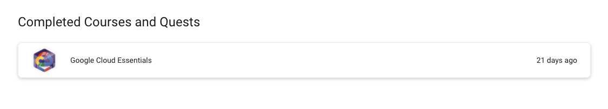

Google DSC에 가입했더니 QwickLabs Advanced Subscription을 줬다.(아싸~~~)
들뜬 마음으로 Google Cloud Essentials를 수강하는데, 정말 Introduction Level 이어서 살짝 아쉬웠다. 정말 GCP 기본 사용법을 알려주는 수준이다.
(하지만 k8s를 처음 접하는 사람들에게는 뭔소리인가 생각이 들 것이다.)

- GSP282 (A Tour of Qwiklabs and Google Cloud) : Qwicklab이 어떻게 이루어져 있는지, 그리고 어떻게 Lab을 시작하는지 알려준다. 중간 중간 퀴즈가 있는데, 설명을 제대로 안읽으면 틀릴 수 있다.

- GSP001 (Creating a Virtual Machine) : Qwicklab에서 Kubernetes 등을 작동시킬 가상 머신을 어떻게 세팅하는지 알려준다. gcloud console로 한번 만든 후, GUI로 한번 더 만들어보며 체크한다. 또한, Region과 Zone에 관한 개념이 간단히 소개된다.

- GSP002 (Getting Started with Cloud Shell & gcloud) : gcloud console 사용법을 배운다. 특히 `gcloud beta interactive` 커맨드로 플러그인 연결을 한 효과를 준 점은 매우 흥미로웠다. 이 커맨드를 입력하면 콘솔에서 다음 나올 수 있는 명령어 예시를 보여준다.

- GSP100 (Kubernetes Engine: Qwik Start) : GCP에서의 Kubernetes Engine을 어떻게 사용하는지 간략하게 나온다. 여기서 Kubernetes가 어떻게 사용되는지 Google Cloud 공식문서 링크를 주는데, 처음 보는 사람은 띠용할게 보인다.

- GSP007 (Set Up Network and HTTP Load Balancers) : Service를 통해서 Load Balancing을 하는 방법과 Ingress 를 통해서 Load Balancing을 하는 방법이 소개된다. 이는 Service가 L4에서 작동하고, Ingress가 L7에서 작동한다가 무슨 의미인지 안다면 이해가 쉬울 것 같다.

모든 과정을 마치니 다음과 같은 뱃지 인증이 생겼다. (본격적으로 k8s 공부하러 가야지~~~)

