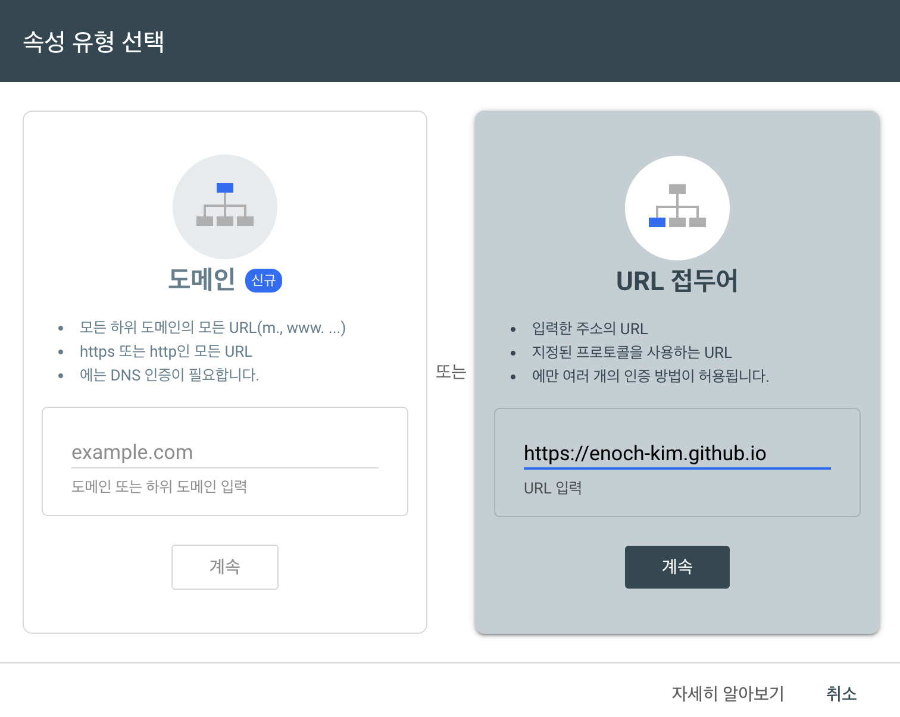
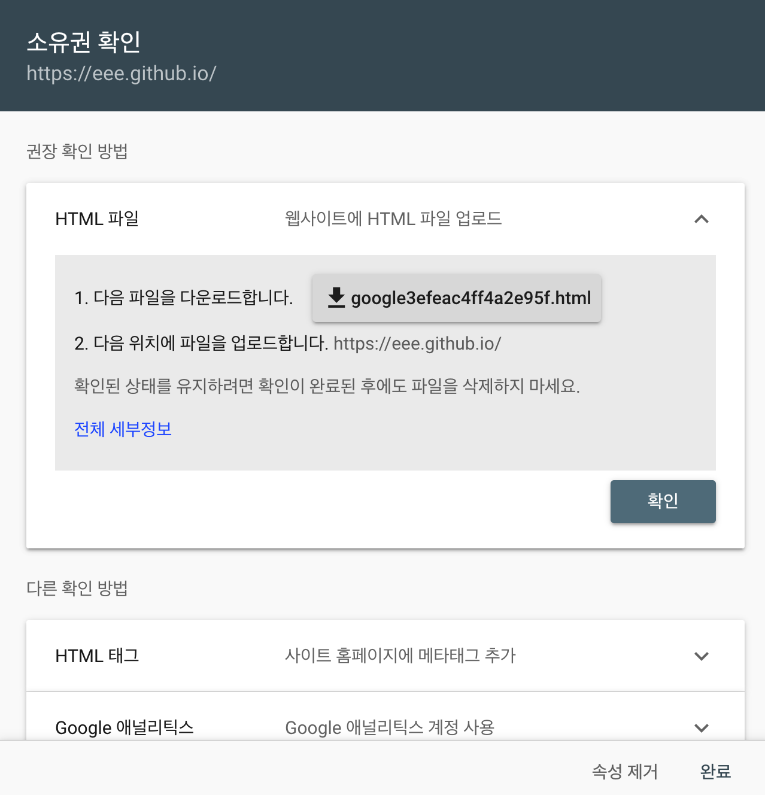
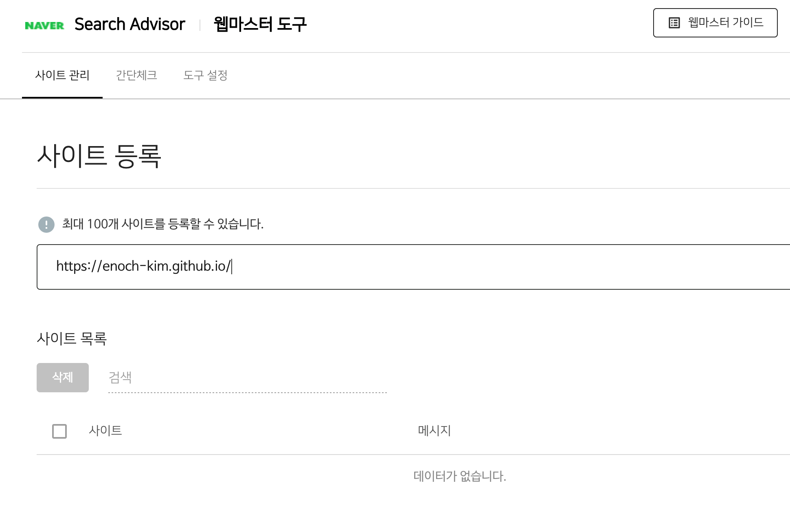

## Goal

- jekyll-sitemap Plugin Setting
- Google 검색엔진 노출
- Naver 검색엔진 노출

Jekyll로 블로그를 구성했지만 구글이나 네이버에서 검색했을 때, 검색결과에 내 블로그가 없는 것을 볼 수 있습니다.
jekyll-sitemap plugin을 입력은 해놓고 등록을 해두지 않았기 때문입니다.

Jekyll의 Site Map 속성이 무엇이냐구요?
> Sitemaps are an easy way for webmasters to inform search engines about pages on their sites that are available for crawling. In its simplest form, a Sitemap is an XML file that lists URLs for a site along with additional metadata about each URL (when it was last updated, how often it usually changes, and how important it is, relative to other URLs in the site) so that search engines can more intelligently crawl the site.

> Web crawlers usually discover pages from links within the site and from other sites. Sitemaps supplement this data to allow crawlers that support Sitemaps to pick up all URLs in the Sitemap and learn about those URLs using the associated metadata. Using the Sitemap protocol does not guarantee that web pages are included in search engines, but provides hints for web crawlers to do a better job of crawling your site.

요약하자면 검색엔진이 웹페이지를 크롤링할 때 사용하기 위한 정보입니다.
블로그를 노출할 때, 사이트맵이 없다면 검색엔진의 크롤링 봇이 어떤 페이지는 접근할 수 있고 어떤 조건에 따라 크롤링 하면 되는지 알려주는 것이죠.

자 그럼 한번 Site Map을 설정해봅시다.

### Jekyll Site Map Setting (+ RSS feed)

Jekyll 블로그 Site Map을 설정하는 방식은 두가지가 있습니다.

1. 개인 Site Map을 Customizing하는 방식. 이 경우 마음대로 원하는 규칙을 생성할 수 있다는 장점이 있습니다. (이 [블로그](https://gmlwjd9405.github.io/2017/10/20/include-blog-in-a-GoogleSearchEngine.html) 참조)
2. [jekyll-sitemap Plugin](https://github.com/jekyll/jekyll-sitemap)을 사용하는 방식. 이 경우 쉽게 설정할 수 있지만 원하는 규칙을 생성하는데 제약이 있습니다.

블로그 검색 엔진 노출을 체계적으로 하고싶지는 않기에, jekyll-sitemap Plugin을 사용하여 설정해보겠습니다.

우선, `_config.yml` 파일에 `url` property에 `http://{github username}.github.io`를 추가해줍니다.
그 후 plugin 속성에 `jekyll-sitemap`을 추가합니다.

검색을 하다보면 robot.txt 파일에 대한 내용이 있을 겁니다. robot.txt 파일이 대체 뭘까요?

[나무위키](https://namu.wiki/w/robots.txt)의 robot.txt 파일에 대한 한 줄 요약은 다음과 같습니다.
> robots.txt는 웹사이트에 웹 크롤러같은 로봇들의 접근을 제어하기 위한 규약이다. 아직 권고안이라 꼭 지킬 의무는 없다.

하지만 저희는 robot.txt를 따로 생성할 필요가 없습니다. 왜냐하면 jekyll-sitemap Plugin에 포함되어있기 때문입니다.
Plugin에 의해서 _site directory에 robot.txt가 자동으로 생성됩니다.

### Google 검색엔진 노출

Google 검색 엔진에 블로그를 노출하기 위해서는 [Google Webmaster](https://www.google.com/webmasters/tools/home?hl=ko)에 블로그를 등록해야합니다.

위 화면에서 오른쪽의 `URL 접두어`에 자신의 웹사이트를 `https`를 포함하여 입력합니다.

그렇면 다음의 화면이 나올텐데요? 해당 xml 파일을 다운받아 `{github username}.github.io` repository의 root directory에 넣어줍니다.
origin에 Push 하고 확인을 눌러줍니다.

이제 한번 블로그 글 내용을 구글에서 검색해봅시다. 다음과 같이 잘 동작하는 것을 볼 수 있습니다.

나머지 설정은 [jekyll-sitemap](https://github.com/jekyll/jekyll-sitemap) 깃헙 페이지를 참고해주세요.

### Naver 검색엔진 노출

Naver 검색 엔진에 노출되기 위해서는 Google과 동일하게 [Naver Webmaster](https://searchadvisor.naver.com/console/board)에 등록해야합니다.

위의 화면에서 http를 포함한 자신의 사이트를 등록해주세요.

그럼 Google과 유사하게 html파일을 받으라고 할 것입니다. `root` directory에 위치시키고 origin에 Push 해줍시다.
화면에 나와있는대로 url을 클릭하여 잘 작동되는지 확인한 후 소유확인 버튼을 클릭하면 끝 ~
