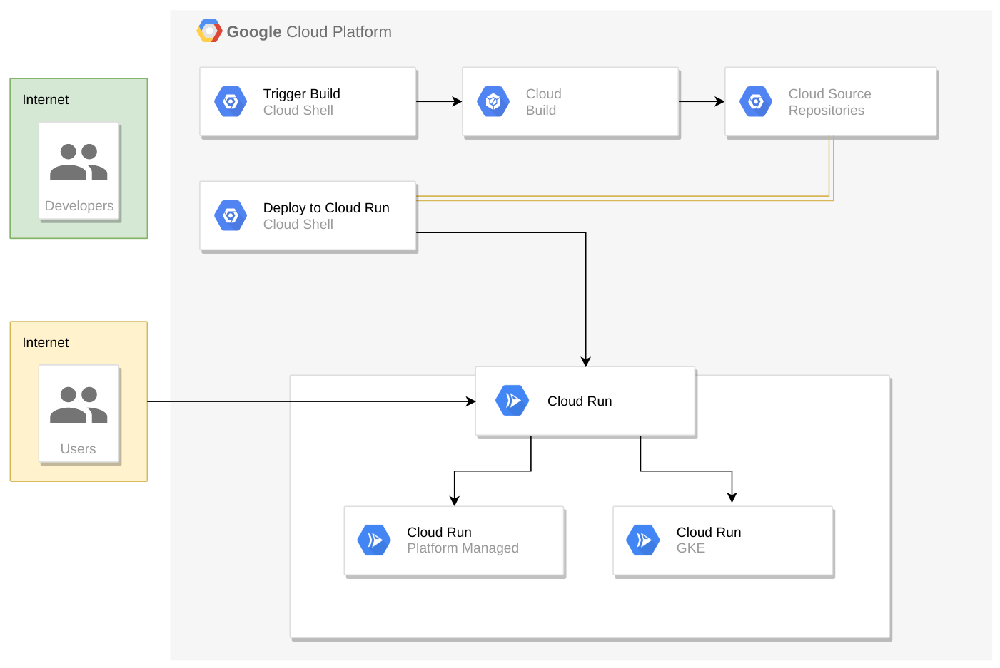
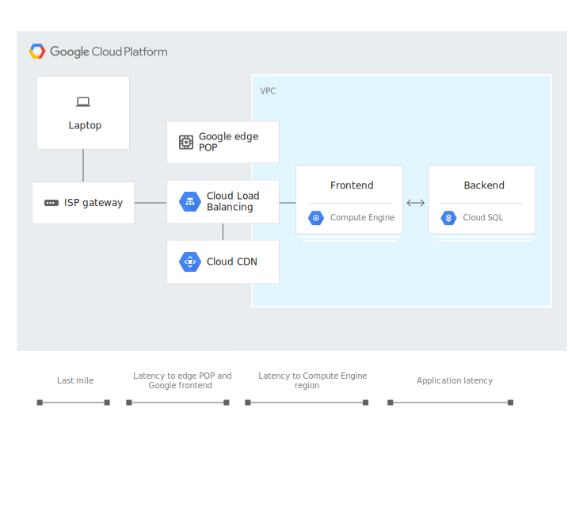
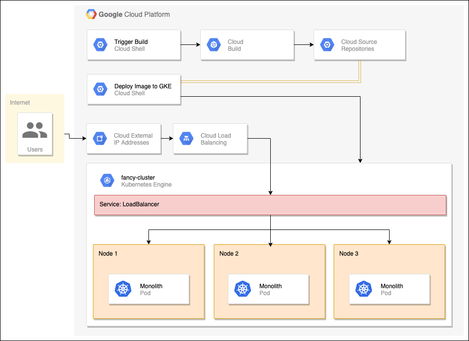

Google의 QwickLabs의 Build a Website on Google Cloud 퀘스트를 진행한 후기.
GCP에 다양한 플랫폼이 있어 무엇을 사용할 지 고민하던 중 간단한 웹을 Deploy하며 비교해볼 수 있는 퀘스트여서 공부해봤다.
퀘스트에서는 간단한 웹을 각각 Cloud Run, Compute Engine, Kubernetes Engine을 사용하여 Deploy하는 법을 알려준다.
(나중에 무슨 내용이 있는지 확인 가능하도록..)

1. Deploy Your Website on Cloud Run
    [Cloud Run](https://cloud.google.com/run)의 경우 PaaS Service를 제공하는 것으로 보인다. [Google Knative](https://cloud.google.com/knative/)를 사용해서 Serverless하게 어플리케이션을 GKE Cluster에 Deploy해주고, 사용자는 오로지 프론트 코드만으로 구동하는 것 같다.
    (~~이외에도 scale to zero 등을 제공한다 하는데, Knative를 사용하니 다양한거 아닌가...~~)

    

    처음에는 Cloud Build를 통해 GCR(Google Container Registry)에 등록하는 법을 설명한다.
    Cloud Build를 사용하기 위해서는 api를 활성화(?)해야 한다.

    ```sh
    gcloud services enable cloudbuild.googleapis.com
    gcloud builds submit --tag gcr.io/${GOOGLE_CLOUD_PROJECT}/monolith:1.0.0 .
    ```

    위의 코드에서 보면 알 수 있듯이, GCR에 자신의 프로젝트 이름으로 태그를 달아 빌드하여 등록한다.

    Cloud Build를 통해 GCR에 등록했다면 이제 Cloud Run을 통해서 앱을 Deploy할 차례인데,
    Cloud Run은 완전히 PaaS 형태로 띄우는 형식과 GKE에서 Layer를 추상화해서 띄우는 형식이 있다.
    여기서는 간단한 웹을 띄울 것이기 때문에 전자의 방식을 택했고 Cloud Run API를 사용하기 위해 활성화(?)를 해주었다.

    ```sh
    gcloud services enable run.googleapis.com
    gcloud run deploy --image=gcr.io/${GOOGLE_CLOUD_PROJECT}/monolith:1.0.0 --platform managed
    ```

    진행하다보면 Revision 개념이 나오는데, Knative에 있는 Revision을 의미하는 것 같다. 즉, 해당 순간의 앱의 Configuration 스냅샷을 의미한다.
    앱의 상태가 변경됨에 따라서 Revision이 생성되고 zero downtime을 갖는다. Knative Serving Component에서
    Blue/Green Deployment Pattern을 사용하기 때문이다.

2. Hosting a Web App on Google Cloud Using Compute Engine
    Google Compute Engine을 사용하여 웹을 띄워보는 코스. 여기서 Compute Engine이 GKE나 App Engine과 다른 기능을 제공한다고 말한다. 인프라를 보다 정교하게 컨트롤 할 수 있다는데.. (~~잘 모르겠다.~~)
    지금까지 했던 코스 중 가장 시간이 촉박했다. Compute Engine을 전반적으로 다룰 뿐 더러 Managed Instance Group, Health Check, LoadBalancer 그리고 Content Delivery Network(CDN)도 다뤄 내용이 많았다.

    우선 Compute Engine을 사용하기 위해서는 Compute Engine API를 활성화(?) 한다. (gcloud 에서는 api 활성화가 이렇게 활성화 방식으로 사용되어 편한 것 같다. ~~실수로 안끄면 돈 많이 나갈 것 같다~~)
    그리고 여기서 코드를 빌드하기 위해서 GCS bucket(Google Cloud Storage bucket)을 사용한다. (~~그럼 GCS부터 설명해야하는거 아냐?!~~)

    ```sh
    gcloud services enable compute.googleapis.com
    # 새로운 gcs bucket 생성
    gsutil mb gs://fancy-store-$DEVSHELL_PROJECT_ID
    ```

    Cloud Run 코스와 동일한 레포지터리를 사용한다. 레포지터리를 클론한 후 root 디렉토리에 start-up 스크립트를 생성한다.
    이 start-up 스크립트는 앱을 실행하는데 필요한 파일을 다운받고, 앱의 소스코드를 가져와 실행하도록 되어있다.
    그 후 GCS에 올려 인스턴스의 수행 이미지로 start-up 스크립트를 url로 지정하여 인스턴스를 생성한다. 프론트의 경우 미리
    React 앱을 빌드하여 GCS에 업로드 하는데, 이때 빌드 전 .env 파일에서 백엔드 인스턴스의 IP를 환경변수로 설정해주기 때문에 제대로 동작한다. Compute Engine의 경우 방화벽 룰을 설정할 수 있는데, 여기서는 프론트와 백엔드에 접근하는 포트 번호를 지정해주는데 사용되었다.

    단순한 인스턴스가 아닌 Managed Instance Group을 생성할 수 있는데, 클러스터의 동일한 앱이 같은 워커노드에서 실행되듯이 (개념이 유사하다는 것이다.) Managed Instance Group의 경우도 동일한 존에서 실행된다.
    이로써 관리가 수월해지는 이점이 있다. MIG를 생성하기 위해서 우선 Instance Template을 사용하는데,
    이 템플릿은 MIG의 Configuration을 정의하며 재사용이 가능하다.

    이제 MIG를 생성하고, Auto Healing 설정을 한 후 Load Balancer를 생성한다. 로드 밸런서의 종류도 다양하지만
    여기서는 HTTP(S) Load Balancer를 사용한다. HTTP 로드 밸런서의 경우 HTTP proxy에 들어온 request에 따라
    다른 인스턴스로 보내주는 역할을 한다.

    MIG를 Autoscaling 해주는 설정을 하는데, 이때 Load Balancer의 Utilization에 따라서 실행한다. 예를들어
    utilization을 0.60으로 설정하면 Load Balancer가 60% 사용됐을 시 instance를 추가로 생성하는 역할을 해준다.

    

    마지막으로 CDN (Content Delivery Network)를 사용하는데, 사용자가 HTTP request를 요청하면 이 요청은 GFE (Google Front End)에 도달해 우선적으로 CDN Cache를 확인한다. 그래서 동일한 요청에 대한 응답이 Cache에 있다면 해당 Request에 즉각적인 응답을 해 효율을 높여주고, 만약 없다면 백엔드로 보내 해당 요청을 처리한 후 response를
    CDN Cache에 저장한다.

3. Deploy, Scale, and Update Your Website on Google Kubernetes Engine
    Google Kubernetes Engine을 사용하여 웹을 띄워보는 코스. GKE Cluster를 생성한 후, 예시 레포의 deployment 템플릿을 사용하여 웹사이트를 배포한다. 배포 후에 LoadBalancer 서비스로 로드 밸런싱 연결을 해주고, Deployment 컨트롤러에 정의된 Rolling Update 방식으로 이미지를 변경하여 아주 기본적인 무중단 배포를 구현한다. (배포 시 고려할 점에 대한 설명이 없는 것이 아쉽다.) 또한, replicaset 수를 증가시키고 감소시키면서 스케일링 하는 것을 소개한다. (이것도 왜 그런 스케일링이 중요한지 설명이 없어 아쉽다.)

    

4. Migrating a Monolithic Website to Microservices on Google Kubernetes Engine
    Google Kubernetes Engine에서 monolith하게 배포했던 웹사이트를 프론트와 벡엔드의 MicroArchitechture(~~라고 할 수 없는 간단한 아키텍처~~)로 migration 하는 것을 다룬다. 단순히 앱을 각각의 deployment로 배포한 후 service를 각각 연결시키는 것으로 끝난다.

5. Build a Website on Google Cloud: Challenge Lab
    지금까지 한것을 체크하는 코스. 위의 4번 내용을 시험받는다.

많은 아쉬움이 남는 코스다. 여러 GCP 서비스를 설명해주는 것은 좋지만, 기본 개념 설명 없이 진행했고, 단순히 따라서 하는 것에 그치는 코스여서 개념을 모르면 도움이 안될 것 같다. 진행하면서 무슨 과정인지 이해 안가 코드를 볼 수 밖에 없었다.
